"# readme" 
<<<<<<< HEAD
# скобки 
### что такое скобки в java script

###### Область видимости — это текущий контекст выполнения, в котором значения и выражения
являются «видимыми» или на них можно сослаться. Если переменная или выражение не находятся в текущем
масштабе, он не будет доступен для использования. Области также могут быть разделены на слои в иерархии,
чтобы дочерние области имели доступ к родительским областям, но не наоборот.

###
• Глобальная область: область действия по умолчанию для всего кода, работающего в режиме сценария.

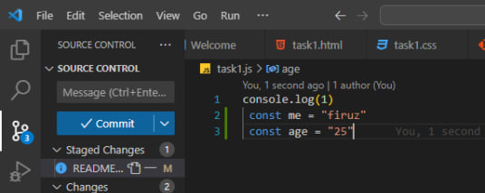

### • Область действия функции: область действия, созданная с помощью функции.

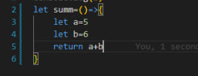

### Область блока: эта область ограничивает объявленную переменную.
внутри определенного блока, от доступа снаружи блока.

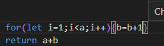

### Область модуля: область действия кода, работающего в модульном режиме.

### Цепочка областей действия

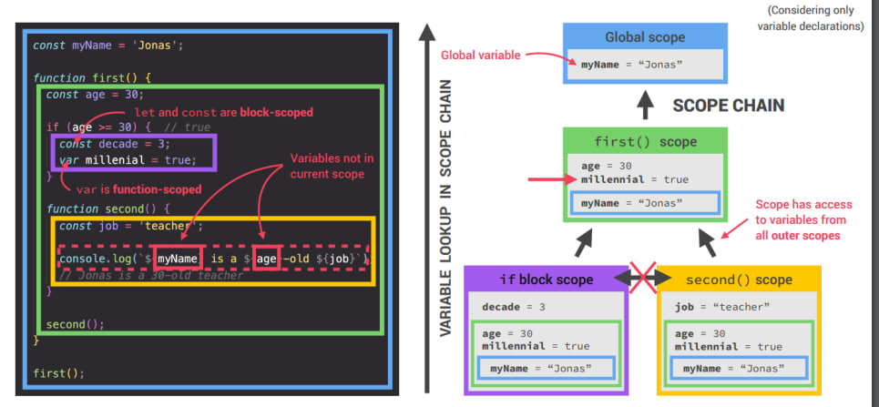

### Подъем (hoisting) в java-скрипте

### Подъем – Переменная (var)
######  весь код, который вы видите в
JavaScript
программа интерпретируется построчно, сверху вниз, как программа
выполняется. это по сути верно, есть одна часть этого как-
предположение, которое может привести к неправильному мышлению о вашей программе.

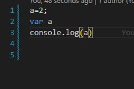

### Подъем — объявление функции
##### Итак, один из способов мышления, своего рода метафора, об процесс состоит в том, что переменная и
функция
объявления «перемещаются» из того места, где они появляются в потоке кода, в начало
код. Это порождает название подъема.

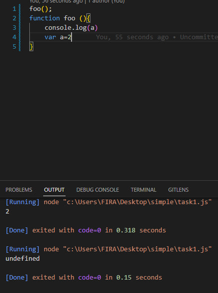

##### 
Объявление функции foo (которое в данном случае включает ее подразумеваемое значение как
фактическая функция) поднимается, так что вызов в первой строке может быть выполнен!
### 
Временная мертвая зона, let и const

##### Надеюсь, вы не увидите этого в производственном коде!

До появления ES6 не существовало другого способа объявления переменных, кроме var. Но ES6 принес нам let и const.

Объявления let и const имеют блочное копирование, что означает, что они доступны только в пределах { }, окружающих их. var, с другой стороны, не имеет такого ограничения.

Вот пример:

let babyAge = 1;
let isBirthday = true;
​
if (isBirthday) {
    let babyAge = 2; 
}
​
console.log(babyAge); // Hmmmm. This prints 1
Это произошло потому, что повторное объявление babyAge равным 2 доступно только внутри блока if. После этого используется первый babyAge. Вы видите, что это две разные переменные?

В отличие от этого, объявление var не имеет области видимости блока:

var babyAge = 1;
var isBirthday = true;
​
if (isBirthday) {
    var babyAge = 2; 
}
​
console.log(babyAge); // Ah! This prints 2
Последнее существенное различие между let / const и var заключается в том, что если вы обращаетесь к var до того, как она была объявлена, она становится неопределенной. Но если вы сделаете то же самое для let и const, они выдадут ошибку ReferenceError.

console.log(varNumber); // undefined
console.log(letNumber); // Doesn't log, as it throws a ReferenceError letNumber is not defined
​
var varNumber = 1;
let letNumber = 1;
Ошибка возникает из-за Temporal Dead Zone.

Объяснение Temporal Dead Zone
Вот что такое TDZ: термин для описания состояния, когда переменные недоступны. Они находятся в области видимости, но не объявлены.

Переменные let и const существуют в TDZ с начала их объемлющей области видимости до момента их объявления.

Можно также сказать, что переменные существуют в TDZ с момента их привязки (когда переменная привязывается к области видимости, внутри которой она находится) до момента ее объявления (когда для этой переменной в памяти резервируется имя).

### Рекурсия
##### Рекурсия – это приём программирования, полезный в ситуациях, когда задача может быть естественно разделена на несколько аналогичных, но более простых задач. Или когда задача может быть упрощена до несложных действий плюс простой вариант той же задачи. Или, как мы скоро увидим, для работы с определёнными структурами данных.

В процессе выполнения задачи в теле функции могут быть вызваны другие функции для выполнения подзадач. Частный случай подвызова – когда функция вызывает сама себя. Это как раз и называется рекурсией.
##### Два способа мышления
В качестве первого примера напишем функцию pow(x, n), которая возводит x в натуральную степень n. Иначе говоря, умножает x на само себя n раз.

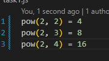

##### Рассмотрим два способа её реализации.

1 Итеративный способ: цикл for:

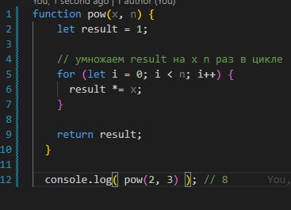

#####  2 Рекурсивный способ: упрощение задачи и вызов функцией самой себя:

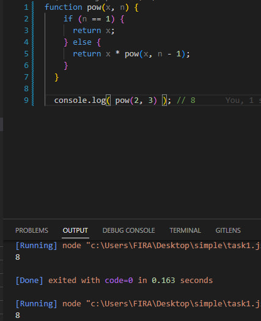

##### Обратите внимание, что рекурсивный вариант отличается принципиально.

Когда функция pow(x, n) вызывается, исполнение делится на две ветви:

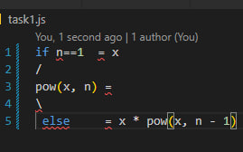

1 Если n == 1, тогда всё просто. Эта ветвь называется базой рекурсии, потому что сразу же приводит к очевидному результату: pow(x, 1) равно x.
2 Мы можем представить pow(x, n) в виде: x * pow(x, n - 1). Что в математике записывается как: xn = x * xn-1. Эта ветвь – шаг рекурсии: мы сводим задачу к более простому действию (умножение на x) и более простой аналогичной задаче (pow с меньшим n). Последующие шаги упрощают задачу всё больше и больше, пока n не достигает 1.
### closure(замыкание)
# Замыкание — это комбинация функции и лексического окружения, в котором эта функция была определена. Другими словами, замыкание даёт вам доступ к Scope (en-US) внешней функции из внутренней функции. В JavaScript замыкания создаются каждый раз при создании функции, во время её создания.
### Лексическая область видимости
Рассмотрим следующий пример:

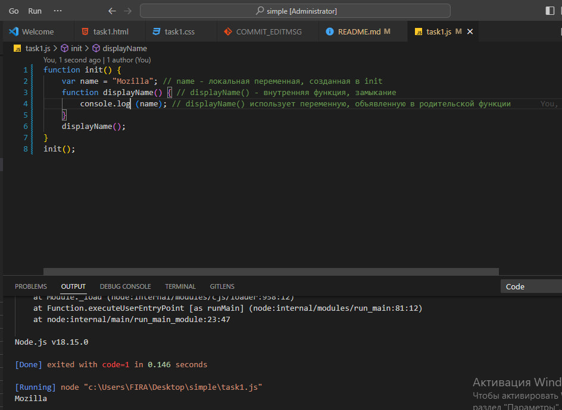

##### init() создаёт локальную переменную name и определяет функцию displayName(). displayName() — это внутренняя функция — она определена внутри init() и доступна только внутри тела функции init(). Обратите внимание, что функция displayName() не имеет никаких собственных локальных переменных. Однако, поскольку внутренние функции имеют доступ к переменным внешних функций, displayName() может иметь доступ к переменной name, объявленной в родительской функции init().
### Замыкание
##### Рассмотрим следующий пример:

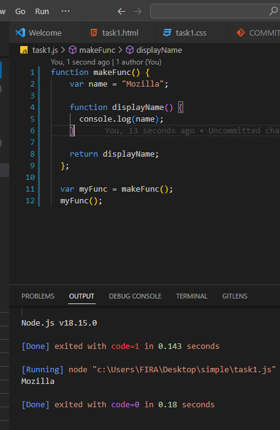

#
Если выполнить этот код, то результат будет такой же, как и выполнение init() из предыдущего примера: строка "Mozilla" будет показана в JavaScript alert диалоге. Что отличает этот код и представляет для нас интерес, так это то, что внутренняя функция displayName() была возвращена из внешней до того, как была выполнена.

На первый взгляд, кажется неочевидным, что этот код правильный, но он работает. В некоторых языках программирования локальные переменные-функции существуют только во время выполнения этой функции. После завершения выполнения makeFunc() можно ожидать, что переменная name больше не будет доступна. Однако, поскольку код продолжает нормально работать, очевидно, что это не так в случае JavaScript.

Причина в том, что функции в JavaScript формируют так называемые замыкания. Замыкание — это комбинация функции и лексического окружения, в котором эта функция была объявлена. Это окружение состоит из произвольного количества локальных переменных, которые были в области действия функции во время создания замыкания. В рассмотренном примере myFunc — это ссылка на экземпляр функции displayName, созданной в результате выполнения makeFunc. Экземпляр функции displayName в свою очередь сохраняет ссылку на своё лексическое окружение, в котором есть переменная name. По этой причине, когда происходит вызов функции myFunc, переменная name остаётся доступной для использования и сохранённый в ней текст "Mozilla" передаётся в alert.
=======

>>>>>>> d278566aba0395a165d566705fe34a95c2d361f0
